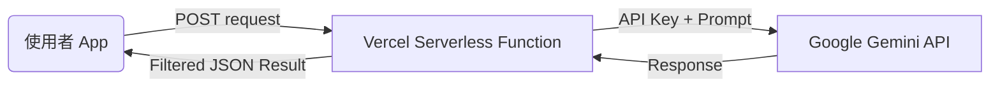

# Vercel 後端 Proxy 技術方案 (Gemini API 代理)

## 1. 設計初衷
為了保護 **Google Gemini API Key** 不被前端用戶盜用，本專案採用 **Vercel Serverless Functions** 作為後端代理伺服器。

*   **安全性**：API Key 僅存在於 Vercel 的環境變數（Secret）中，不隨前端程式碼發布。
*   **成本控制**：利用 Vercel 的免費額度，達成零成本的後端代理與 CORS 處理。
*   **靈活性**：隨時在雲端更換 Key，不需要重新編譯與發布前端網頁。

---

## 2. 系統架構

---

## 3. 檔案結構與實作
在本專案 root 目錄下建立了 `api/` 資料夾，Vercel 會自動將其識別為 Serverless Functions。

*   **檔案路徑**：`api/gemini.js`
*   **實作邏輯**：
    *   接收 `POST` 請求。
    *   從伺服器本地環境變數 `process.env.GEMINI_API_KEY` 讀取金鑰。
    *   將請求轉發至 `https://generativelanguage.googleapis.com/...`。
    *   支援對話紀錄（History）與生成配置（GenerationConfig）的傳遞。
    *   內建 CORS 跨域許可，允許 GitHub Pages 網域呼叫。

---

## 4. 前端串接設定
在 `App.js` 中，透過環境變數 `EXPO_PUBLIC_VERCEL_PROXY_URL` 指定代理伺服器網址。

*   **預設網址範例**：`https://english-talk-three.vercel.app/api/gemini`
*   **連線方式**：使用標準 `fetch` API 發送 `JSON POST`。

---

## 5. 維護與操作流程

### 5.1 如何更改 Gemini API Key
如果你需要更換金鑰，**不需要修改程式碼**：
1.  進入 [Vercel Dashboard](https://vercel.com/dashboard)。
2.  找到 `english-talk` 專案。
3.  點擊 **Settings > Environment Variables**。
4.  找到 `GEMINI_API_KEY` 並更新它的值。
5.  **重要**：更新後需在專案頁面點擊 **Redeploy** 或是再次在本地執行 `npx vercel --prod` 讓設定生效。

### 5.2 如何監控日誌
如果對話發生錯誤，可以到 Vercel 的 **Logs** 分頁查看伺服器端的錯誤日誌，這能幫助你診斷是金鑰過期還是 API 回報異常。

### 5.3 自動化部署 (CI/CD)
本專案已連結至 Vercel 的 GitHub 整合功能：
1.  **觸發條件**：只要有代碼 `push` 到 `main` 分支。
2.  **自動執行**：Vercel 會自動感應變更，並重新部署 `api/` 資料夾中的後端功能。
3.  **優點**：由 Vercel 官網直接處理，不需要在 GitHub Actions 中設定繁瑣的金鑰。
